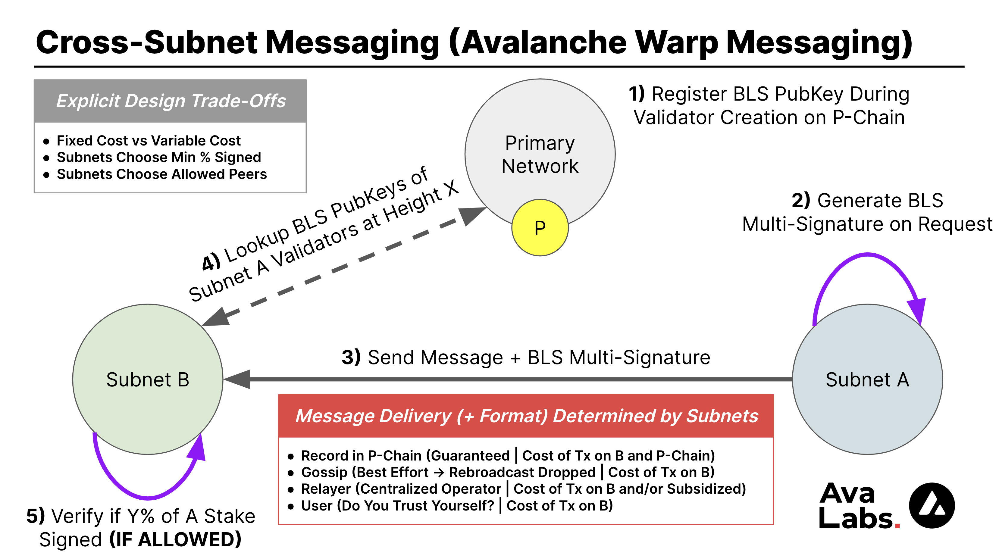

<p align="center">
  
</p>
<p align="center">
  Opinionated Framework for Building Hyper-Scalable Blockchains on Avalanche
</p>
<p align="center">
  <a href="https://goreportcard.com/report/github.com/ava-labs/hypersdk"></a>
  <a href="https://github.com/ava-labs/hypersdk/actions/workflows/hypersdk-unit-tests.yml"></a>
  <a href="https://github.com/ava-labs/hypersdk/actions/workflows/hypersdk-static-analysis.yml"></a>
<a href="./LICENSE" ></a>
</p>

---

The freedom to create your own [Virtual Machine (VM)](https://docs.avax.network/learn/avalanche/virtual-machines),
or blockchain runtime, is one of the most exciting and powerful aspects of building
on Avalanche, however, it is difficult and time-intensive to do from scratch. Forking
existing Avalanche VMs makes it easier to get started, like [spacesvm](https://github.com/ava-labs/spacesvm)
or [subnet-evm](https://github.com/ava-labs/subnet-evm), but is time-consuming
and complex to ensure correctness as changes occur upstream (in repos which
often weren't meant to be used as a library).

The `hypersdk` is the first (of many) frameworks dedicated to making it
faster, safer, and easier to launch your own optimized blockchain on an Avalanche
Subnet. By hiding much of the complexity of building your own blockchain
runtime behind Avalanche-optimized data structures and algorithms, the
`hypersdk` enables builders to focus their attention on the aspects of their
runtime that make their project unique (and override the defaults only if needed).
For example, a DEX-based project should focus on implementing a novel trading
system and not on transaction serialization, assuming that is already done
efficiently for them.

This opinionated design methodology means that most runtimes built on the
`hypersdk`, called a `hypervm`, only need to implement 500-1000 lines of their own
code to add custom interaction patterns (and don't need to copy-paste code from upstream
that they need to keep up-to-date). However, if you do want to provide your own
mechanism, you can always override anything you are using upstream if you can
compose something better suited for your application. That same DEX-based
project may wish to implement custom block building logic that prioritizes the
inclusions of trades of certain partners or that interact with certain order
books.

Last but certainly not least, the usage of these Avalanche-optimized data structures
and algorithms means that your `hyperchain` can process thousands of transactions per second
without needing to hire a team of engineers to optimize it or understanding
anything about how it works under the hood...but you can certainly achieve
higher throughput if you do ;).

### Terminology
* `hypersdk`: framework for building high-performance blockchains on Avalanche
* `hypervm`: Avalanche Virtual Machine built using the `hypersdk`
* `hyperchain`: `hypervm` deployed on the Avalanche Network

## Status
`hypersdk` is considered **ALPHA** software and is not safe to use in
production. The framework is under active development and may change
significantly over the coming months as its modules are optimized and
audited.

## Features
### Efficient State Management
All `hypersdk` state is stored using [`x/merkledb`](https://github.com/ava-labs/avalanchego/blob/master/x/merkledb/README.md),
a path-based merkelized radix tree implementation provided by `avalanchego`. This high-performance
data structure minimizes the on-disk footprint of any `hypervm` out-of-the-box by deleting
any data that is no longer part of the current state (without performing any costly reference counting).

The use of this type of data structure in the blockchain context was pioneered
by the [go-ethereum](https://github.com/ethereum/go-ethereum) team in an effort
to minimize the on-disk footprint of the EVM. We wanted to give a Huge shoutout
to that team for all the work they put into researching this approach.

#### Dynamic State Sync
Instead of requiring nodes to execute all previous transactions when joining
any `hyperchain` (which may not be possible if there is very high throughput on a Subnet),
the `hypersdk` just syncs the most recent state from the network. To avoid falling
behind the network while syncing this state, the `hypersdk` acts as an Avalanche Light
Client and performs consensus on newly processed blocks without verifying them (updating its
state sync target whenever a new block is accepted).

The `hypersdk` relies on [`x/sync`](https://github.com/ava-labs/avalanchego/tree/master/x/sync),
a bandwidth-aware dynamic sync implementation provided by `avalanchego`, to
sync to the tip of any `hyperchain`.

#### Pebble as Default
Instead of employing [`goleveldb`](https://github.com/syndtr/goleveldb), the
`hypersdk` uses CockroachDB's [`pebble`](https://github.com/cockroachdb/pebble) database for
on-disk storage. This database is inspired by LevelDB/RocksDB but offers [a few
improvements](https://github.com/cockroachdb/pebble#advantages).

Unlike other Avalanche VMs, which store data inside `avalanchego's` root
database, `hypervms` store different types of data (state, blocks, metadata, etc.) under
a set of distinct paths in `avalanchego's` provided `chainData` directory.
This structure enables anyone running a `hypervm` to employ multiple logical disk
drives to increase a `hyperchain's` throughput (which may otherwise be capped by a single disk's IO).

### Optimized Block Execution Out-of-the-Box
The `hypersdk` is primarily about an obsession with hyper-speed and
hyper-scalability (and making it easy for developers to achieve both by
wrapping their work in opinionated and performant abstractions).
Developers don't care how easy it is to launch or maintain their own
blockchain if it can't process thousands of transactions per second with low
time-to-finality. For this reason, most development time on the `hypersdk`
thus far has been dedicated to making block verification and state management
as fast and efficient as possible, which both play a large role in making this
happen.

#### State Pre-Fetching
`hypersdk` transactions must specify the keys they will touch in state (read
or write) during execution and authentication so that all relevant data can be
pre-fetched before block execution starts, which ensures all data accessed during
verification of a block is done so in memory). Notably, the keys specified here
are not keys in a merkle trie (which may be quite volatile) but are instead the
actual keys used to access data by the storage engine (like your address, which
is much less volatile and not as cumbersome of a UX barrier).

This restriction also enables transactions to be processed in parallel as distinct,
ordered transaction sets can be trivially formed by looking at the overlap of keys
that transactions will touch.

_Parallel transaction execution was originally included in `hypersdk` but
removed because the overhead of the naïve mechanism used to group transactions
into execution sets prior to execution was slower than just executing transactions
serially with state pre-fetching. Rewriting this mechanism has been moved to the
`Future Work` section and we expect to re-enable this functionality soon._

#### [Optional] Parallel Signature Verification
The `Auth` interface (detailed below) exposes a function called `AsyncVerify` that
the `hypersdk` may call concurrently (may invoke on other transactions in the same
block) at any time prior/during block execution. Most `hypervms` perform signature
verification in this function and save any state lookups for the full `Auth.Verify`
(which has access to state, unlike `AsyncVerify`). The generic support for performing certain
stateless activities during execution can greatly reduce the e2e verification
time of a block when running on powerful hardware.

#### [Optional] Batch Signature Verification
Some public-key signature systems, like [Ed25519](https://ed25519.cr.yp.to/), provide
support for verifying batches of signatures (which can be more much efficient than
verifying each signature individually). The `hypersdk` generically supports this
capability for any `Auth` module that implements the `AuthBatchVerifier` interface,
even parallelizing batch computation for systems that only use a single-thread to
verify a batch.

### Multidimensional Fee Pricing
Instead of mapping transaction resource usage to a one-dimensional unit (i.e. "gas"
or "fuel"), the `hypersdk` utilizes five independently parameterized unit dimensions
(bandwidth, compute, storage[read], storage[create], storage[modify]) to meter
activity on each `hypervm`. Each unit dimension has a unique metering schedule
(i.e. how many units each resource interaction costs), target, and max utilization
per rolling 10 second window.

When network resources are independently metered, they can be granularly priced
and thus better utilized by network participants. Consider a simple example of a
one-dimensional fee mechanism where each byte is 2 units, each compute cycle is 5 units,
each storage operation is 10 units, target usage is 7,500 units per block, and the max
usage in any block is 10,000 units. If someone were to use 5,000 bytes of block data
without utilizing any CPU/storing data in state, they would exhaust the block capacity
without using 2 of the 3 available resources. This block would also increase the price
of each unit because usage is above the target. As a result, the price to use compute
and storage in the next block would be more expensive although neither has been used.
In the `hypersdk`, only the price of bandwidth would go up and the price of CPU/storage
would stay constant, a better reflection of supply/demand for each resource.

So, why go through all this trouble? Accurate and granular resource metering is required to
safely increase the throughput of a blockchain. Without such an approach, designers
need to either overprovision the network to allow for one resource to be utilized to maximum
capacity (max compute unit usage may also allow unsustainable state growth) or bound capacity
to a level that leaves most resources unused. If you are interested in reading more analysis
of multidimensional fee pricing, [Dynamic Pricing for Non-fungible Resources: Designing
Multidimensional Blockchain Fee Markets](https://arxiv.org/abs/2208.07919) is a great resource.

#### Invisible Support
Developers must have to implement a ton of complex code to take advantage of this
fee mechanism, right? Nope!

Multidimensional fees are abstracted away from `hypervm` developers and managed
entirely by the `hypersdk`. `hypervm` designers return the fee schedule, targets,
and max usage to use in `Rules` (allows values to change depending on timestamp) and
the `hypersdk` will handle the rest:
```golang
GetMinUnitPrice() Dimensions
GetUnitPriceChangeDenominator() Dimensions
GetWindowTargetUnits() Dimensions
GetMaxBlockUnits() Dimensions

GetBaseComputeUnits() uint64
GetBaseWarpComputeUnits() uint64
GetWarpComputeUnitsPerSigner() uint64
GetOutgoingWarpComputeUnits() uint64

GetColdStorageKeyReadUnits() uint64
GetColdStorageValueReadUnits() uint64 // per chunk
GetWarmStorageKeyReadUnits() uint64
GetWarmStorageValueReadUnits() uint64 // per chunk
GetStorageKeyCreateUnits() uint64
GetStorageValueCreateUnits() uint64 // per chunk
GetColdStorageKeyModificationUnits() uint64
GetColdStorageValueModificationUnits() uint64 // per chunk
GetWarmStorageKeyModificationUnits() uint64
GetWarmStorageValueModificationUnits() uint64 // per chunk
```

An example configuration may look something like:
```golang
MinUnitPrice:               chain.Dimensions{100, 100, 100, 100, 100},
UnitPriceChangeDenominator: chain.Dimensions{48, 48, 48, 48, 48},
WindowTargetUnits:          chain.Dimensions{20_000_000, 1_000, 1_000, 1_000, 1_000},
MaxBlockUnits:              chain.Dimensions{1_800_000, 2_000, 2_000, 2_000, 2_000},

BaseComputeUnits:          1,
BaseWarpComputeUnits:      1_024,
WarpComputeUnitsPerSigner: 128,
OutgoingWarpComputeUnits:  1_024,

ColdStorageKeyReadUnits:           5,
ColdStorageValueReadUnits:         2,
WarmStorageKeyReadUnits:           1,
WarmStorageValueReadUnits:         1,
StorageKeyCreateUnits:             20,
StorageValueCreateUnits:           5,
ColdStorageKeyModificationUnits:   10,
ColdStorageValueModificationUnits: 3,
WarmStorageKeyModificationUnits:   5,
WarmStorageValueModificationUnits: 3,
```

#### Avoiding Complex Construction
Historically, one of the largest barriers to supporting
multidimensional fees has been the complex UX it can impose
on users. Setting a one-dimensional unit price and max unit usage
already confuses most, how could you even consider adding more?

The `hypersdk` takes a unique approach and requires users to set a
single `Base.MaxFee` field, denominated in tokens rather than usage.
The `hypersdk` uses this fee to determine whether or not a transaction
can be executed and then only charges what it actually used. For
example, a user may specify to use up to 5 TKN but may only be charged
1 TKN, depending on their transaction's unit usage and the price of
each unit dimension during execution. This approach is only possible
because the `hypersdk` requires transactions to be "fully specified"
before execution (i.e. an executor can determine the maximum amount
of units that will be used by each resource without simulating the
transaction).

It is important to note that the resource precomputation can be quite
pessimistic (i.e. assumes the worse) and can lead to the maximum fee
for a transaction being ~2x as large as the fee it uses on-chain (depending
on the usage of cold/warm storage, as discussed later). In practice,
this means that accounts may need a larger balance than they otherwise
would to issue transactions (as the `MaxFee` must be payable during
execution). In the future, it will also be possible to optionally
specify a max usage of each unit dimension to better bound this pessimism.

#### No Priority Fees
Transactions are executed in FIFO order by each validator and there is no
way for a user to specify some "priority" fee to have their transaction
included in a block sooner. If a transaction cannot be executed when
it is pulled from the mempool (because its `MaxFee` is insufficient), it will
be dropped and must be reissued.

Aside from FIFO handling being dramatically more efficient for each validator,
price-sorted mempools are not particularly useful in high-throughput
blockchains where the expected mempool size is ~0 or there is a bounded transaction
lifetime (60 seconds by default on the `hypersdk`).

#### Separate Metering for Storage Reads, Creations, Modifications
To make the multidimensional fee implementation for the `hypersdk` simpler,
it would have been possible to unify all storage operations (read, create,
modify) into a single unit dimension. We opted not to go this route, however,
because `hypervm` designers often wish to regulate state growth much differently
than state reads or state modification.

Fundamentally, it makes sense to combine resource usage into a single unit dimension
if different operations are scaled substitutes of each other (an executor could translate
between X units of one operation to Y units of another). It is not clear how to compare,
for example, the verification of a signature with the storage of a new key in state
but is clear how to compare the verification of a signature with the addition of two numbers
(just different CPU cycle counts).

Although more nuanced, the addition of new data to state is a categorically different operation
than reading data from state and cannot be compared on a single plane. In other words,
it is not clear how many reads a developer would or should trade for writes and/or that
they are substitutes for each other in some sort of disk resource (by mapping to a
single unit dimension, performing a bunch of reads would make writes more expensive).

#### Size-Encoded Storage Keys
To compute the maximum amount of storage units that a transaction could use,
it must be possible to determine how much data a particular key can read/write
from/to state. The `hypersdk` requires that all state keys are suffixed with
a big-endian encoded `uint16` of the number of "chunks" (each chunk is 64 bytes)
that can be read/stored to satisfy this requirement.

This constraint is equivalent to deciding whether to use a `uint8`, `uint16`, `uint32`,
`uint64`, etc. when storing an unsigned integer value in memory. The tighter a
`hypervm` developer bounds the max chunks to the chunks they will store, the cheaper
the estimate will be for a user to interact with state. Users are only charged, however,
based on the amount of chunks actually read/written from/to state.

#### Block-Based Storage Access Discounts
If a state key has already been accessed in a given block, future access
by the same transaction/future transactions will be more efficient for the
`hypersdk` to handle because the corresponding state is already sitting in memory.
The `hypersdk` automatically tracks which state has already been loaded from disk (whether
read or modified) over an entire block and charges different fees accordingly.

For example, if a transaction modifies a key and then another transaction
is executed which modifies the same value, the net cost for modifying the key
to the `hypervm` (and to the entire network) is much cheaper than modifying a
new key.

### Account Abstraction
The `hypersdk` makes no assumptions about how `Actions` (the primitive for
interactions with any `hyperchain`, as explained below) are verified. Rather,
`hypervms` provide the `hypersdk` with a registry of supported `Auth` modules
that can be used to validate each type of transaction. These `Auth` modules can
perform simple things like signature verification or complex tasks like
executing a WASM blob.

### Nonce-less and Expiring Transactions
`hypersdk` transactions don't use [nonces](https://help.myetherwallet.com/en/articles/5461509-what-is-a-nonce)
to protect against replay attack like many other account-based blockchains. This means users
can submit transactions concurrently from a single account without worrying about ordering them properly
or getting stuck on a transaction that was dropped by the mempool.

Additionally, `hypersdk` transactions contain a time past which they can no longer be included inside
of a `hypersdk` block. This makes it straightforward to take advantage of temporary situations on a
`hyperchain` (if you only wanted your transaction to be valid for a few seconds) and removes
the need to broadcast replacement transactions (if the fee changes or you want
to cancel a transaction).

On the performance side of things, a lack of transaction nonces makes the
mempool more performant (as we no longer need to maintain multiple transactions
for a single account and ensure they are ordered) and makes the network layer
more efficient (we can gossip any valid transaction to any node instead of just
the transactions for each account that can be executed at the moment).

### Avalanche Warp Messaging Support
`hypersdk` provides support for Avalanche Warp Messaging (AWM) out-of-the-box. AWM enables any
Avalanche Subnet to send arbitrary messages to any other Avalanche Subnet in just a few
seconds (or less) without relying on a trusted relayer or bridge (just the validators of the Subnet sending the message).
You can learn more about AWM and how it works
[here](https://docs.google.com/presentation/d/1eV4IGMB7qNV7Fc4hp7NplWxK_1cFycwCMhjrcnsE9mU/edit).

<p align="center">
  
</p>

AWM is a primitive provided by the Avalanche Network used to verify that
a particular [BLS Multi-Signatures](https://crypto.stanford.edu/~dabo/pubs/papers/BLSmultisig.html)
is valid and signed by some % of the stake weight of a particular Avalanche
Subnet (typically the Subnet where the message originated). Specifying when an
Avalanche Custom VM produces a Warp Message for signing, defining the format
of Warp Messages sent between Subnets, implementing some mechanism to gather
individual signatures from validators (to aggregate into a BLS
Multi-Signature) over this user-defined message, articulating how an imported
Warp Message from another Subnet is handled on a destination (if the
destination chooses to even accept the message), and enabling retries in the
case that a message is dropped or the BLS Multi-Signature expires are just a few of the items
left to the implementer.

The `hypersdk` handles all of the above items for you except for defining when
you should emit a Warp Message to send to another Subnet (i.e. what an export looks like on-chain),
what this Warp Message should look like (i.e. what do you want to send to another Subnet), and
what you should do if you receive a Warp Message (i.e. mint assets if you
receive an import).

### Easy Functionality Upgrades
Every object that can appear on-chain (i.e. `Actions` and/or `Auth`) and every chain
parameter (i.e. `Unit Price`) is scoped by block timestamp. This makes it
possible to easily modify existing rules (like how much people pay for certain
types of transactions) or even disable certain types of `Actions` altogether.

Launching your own blockchain is the first step of a long journey of continuous
evolution. Making it straightforward and explicit to activate/deactivate any
feature or config is critical to making this evolution safely.

### Proposer-Aware Gossip
Unlike the Virtual Machines live on the Avalanche Primary Network (which gossip
transactions uniformly to all validators), the `hypersdk` only gossips
transactions to the next few preferred block proposers ([using Snowman++'s
lookahead logic](https://github.com/ava-labs/avalanchego/blob/master/vms/proposervm/README.md)).
This change greatly reduces the amount of unnecessary transaction gossip
(which we define as gossiping a transaction to a node that will not produce
a block during a transaction's validity period) for any `hyperchain` out-of-the-box.

If you prefer to employ a different gossiping mechanism (that may be more
aligned with the `Actions` you define in your `hypervm`), you can always
override the default gossip technique with your own. For example, you may wish
to not have any node-to-node gossip and just require validators to propose
blocks only with the transactions they've received over RPC.

### Transaction Results and Execution Rollback
The `hypersdk` allows for any `Action` to return a result from execution
(which can be any arbitrary bytes), the amount of fee units it consumed, and
whether or not it was successful (if unsuccessful, all state changes are rolled
back). This support is typically required by anyone using the `hypersdk` to
implement a smart contract-based runtime that allows for cost-effective
conditional execution (exiting early if a condition does not hold can be much
cheaper than the full execution of the transaction).

The outcome of execution is not stored/indexed by the `hypersdk`. Unlike most other
blockchains/blockchain frameworks, which provide an optional "archival mode" for historical access,
the `hypersdk` only stores what is necessary to validate the next valid block and to help new nodes
sync to the current state. Rather, the `hypersdk` invokes the `hypervm` with all execution
results whenever a block is accepted for it to perform arbitrary operations (as
required by a developer's use case). In this callback, a `hypervm` could store
results in a SQL database or write to a Kafka stream.

### Support for Generic Storage Backends
When initializing a `hypervm`, the developer explicitly specifies which storage backends
to use for each object type (state vs blocks vs metadata). As noted above, this
defaults to CockroachDB's `pebble` but can be swapped with experimental storage
backends and/or traditional cloud infrastructure. For example, a `hypervm`
developer may wish to manage state objects (for the Path-Based Merkelized Radix
Tree) on-disk but use S3 to store blocks and PostgreSQL to store transaction metadata.

### Continuous Block Production
Unlike other VMs on Avalanche, `hypervms` produce blocks continuously (even if empty).
While this may sound wasteful, it improves the "worst case" AWM verification cost (AWM verification
requires creating a reverse diff to the last referenced P-Chain block), prevents a fallback to leaderless
block production (which can lead to more rejected blocks), and avoids a prolonged post-bootstrap
readiness wait (`hypersdk` waits to mark itself as ready until it has seen a `ValidityWindow` of blocks).

Looking ahead, support for continuous block production paves the way for the introduction
of [chain/validator-driven actions](https://github.com/ava-labs/hypersdk/issues/336), which should
be included on-chain every X seconds (like a price oracle update) regardless of how many user-submitted
transactions are present.

### Unified Metrics, Tracing, and Logging
It is functionally impossible to improve the performance of any runtime without
detailed metrics and comprehensive tracing. For this reason, the `hypersdk`
provides both to any `hypervm` out-of-the-box. These metrics and traces are
aggregated by avalanchego and can be accessed using the
[`/ext/metrics`](https://docs.avax.network/apis/avalanchego/apis/metrics)
endpoint. Additionally, all logs in the `hypersdk` use the standard `avalanchego` logger
and are stored alongside all other runtime logs. The unification of all of
these functions with avalanchego means existing avalanchego monitoring tools
work out of the box on your `hypervm`.

## Examples
We've created three `hypervm` examples, of increasing complexity, that demonstrate what you
can build with the `hypersdk` (with more on the way).

When you are ready to build your own `hypervm`, we recommend using the `morpheusvm` as a template!

### Beginner: `morpheusvm`
_[Who is Morpheus ("The Matrix")?](https://www.youtube.com/watch?v=zE7PKRjrid4)_

The [`morpheusvm`](./examples/morpheusvm) provides the first glimpse into the world of the `hypersdk`.
After learning how to implement native token transfers in a `hypervm` (one of the simplest Custom VMs
you could make), you will have the choice to go deeper (red pill) or to turn back to the VMs that you
already know (blue pill).

_To ensure the `hypersdk` remains reliable as we optimize and evolve the codebase,
we also run E2E tests in the `morpheusvm` on each PR to the `hypersdk` core modules._

### Moderate: `tokenvm`
We created the [`tokenvm`](./examples/tokenvm) to showcase how to use the
`hypersdk` in an application most readers are already familiar with, token minting
and token trading.

The `tokenvm` lets anyone create any asset, mint more of
their asset, modify the metadata of their asset (if they reveal some info), and
burn their asset. Additionally, there is an embedded on-chain exchange that
allows anyone to create orders and fill (partial) orders of anyone else. To
make this example easy to play with, the `tokenvm` also bundles a powerful CLI
tool and serves RPC requests for trades out of an in-memory order book it
maintains by syncing blocks. If you are interested in the intersection of
exchanges and blockchains, it is definitely worth a read (the logic for filling
orders is < 100 lines of code!).

_To ensure the `hypersdk` remains reliable as we optimize and evolve the codebase,
we also run E2E tests in the `tokenvm` on each PR to the `hypersdk` core modules._

### Expert: `indexvm` [DEPRECATED]
_The `indexvm` will be rewritten using the new WASM Programs module._

The [`indexvm`](https://github.com/ava-labs/indexvm) is much more complex than
the `tokenvm` (more elaborate mechanisms and a new use case you may not be
familiar with). It was built during the design of the `hypersdk` to test out the
limits of the abstractions for building complex on-chain mechanisms. We recommend
taking a look at this `hypervm` once you already have familiarity with the `hypersdk` to gain an
even deeper understanding of how you can build a complex runtime on top of the `hypersdk`.

The `indexvm` is dedicated to increasing the usefulness of the world's
content-addressable data (like IPFS) by enabling anyone to "index it" by
providing useful annotations (i.e. ratings, abuse reports, etc.) on it.
Think up/down vote on any static file on the decentralized web.

The transparent data feed generated by interactions on the `indexvm` can
then be used by any third-party (or yourself) to build an AI/recommender
system to curate things people might find interesting, based on their
previous interactions/annotations.

Less technical plz? Think TikTok/StumbleUpon over arbitrary IPFS data (like NFTs) but
all your previous likes (across all services you've ever used) can be used to
generate the next content recommendation for you.

The fastest way to expedite the transition to a decentralized web is to make it
more fun and more useful than the existing web. The `indexvm` hopes to play
a small part in this movement by making it easier for anyone to generate
world-class recommendations for anyone on the internet, even if you've never
interacted with them before.

We'll use both of these `hypervms` to explain how to use the `hypersdk` below.

## How It Works
To use the `hypersdk`, you must import it into your own `hypervm` and implement the
required interfaces. Below, we'll cover some of the ones that your
`hypervm` must implement.

> _Note: `hypersdk` requires a minimum Go version of 1.20_

### Controller
```golang
type Controller interface {
	Initialize(
		inner *VM, // hypersdk VM
		snowCtx *snow.Context,
		gatherer ametrics.MultiGatherer,
		genesisBytes []byte,
		upgradeBytes []byte,
		configBytes []byte,
	) (
		config Config,
		genesis Genesis,
		builder builder.Builder,
		gossiper gossiper.Gossiper,
		vmDB database.Database,
		stateDB database.Database,
		handler Handlers,
		actionRegistry chain.ActionRegistry,
		authRegistry chain.AuthRegistry,
		authEngines map[uint8]AuthEngine,
		err error,
	)

	Rules(t int64) chain.Rules // ms

	// StateManager is used by the VM to request keys to store required
	// information in state (without clobbering things the Controller is
	// storing).
	StateManager() chain.StateManager

	// Anything that the VM wishes to store outside of state or blocks must be
	// recorded here
	Accepted(ctx context.Context, blk *chain.StatelessBlock) error
	Rejected(ctx context.Context, blk *chain.StatelessBlock) error

	// Shutdown should be used by the [Controller] to terminate any async
	// processes it may be running in the background. It is invoked when
	// `vm.Shutdown` is called.
	Shutdown(context.Context) error
}
```

The `Controller` is the entry point of any `hypervm`. It initializes the data
structures utilized by the `hypersdk` and handles both `Accepted` and
`Rejected` block callbacks. Most `hypervms` use the default `Builder`,
`Gossiper`, `Handlers`, and `Database` packages so this is typically a lot of
boilerplate code.

You can view what this looks like in the `tokenvm` by clicking this
[link](./examples/tokenvm/controller/controller.go).

#### Registry
```golang
ActionRegistry *codec.TypeParser[Action, *warp.Message, bool]
AuthRegistry   *codec.TypeParser[Auth, *warp.Message, bool]
```

The `ActionRegistry` and `AuthRegistry` inform the `hypersdk` how to
marshal/unmarshal bytes on-the-wire. If the `Controller` did not provide these,
the `hypersdk` would not know how to extract anything from the bytes it was
provided by the Avalanche Consensus Engine.

_In the future, we will provide an option to automatically marshal/unmarshal
objects if an `ActionRegistry` and/or `AuthRegistry` is not provided using
a default codec._

### Genesis
```golang
type Genesis interface {
	Load(context.Context, atrace.Tracer, chain.Database) error
}
```

`Genesis` is typically the list of initial balances that accounts have at the
start of the network and a list of default configurations that exist at the
start of the network (fee price, enabled txs, etc.). The serialized genesis of
any `hyperchain` is persisted on the P-Chain for anyone to see when the network
is created.

You can view what this looks like in the `tokenvm` by clicking this
[link](./examples/tokenvm/genesis/genesis.go).

### Action
```golang
type Action interface {
	// GetTypeID uniquely identifies each supported [Action]. We use IDs to avoid
	// reflection.
	GetTypeID() uint8

	// ValidRange is the timestamp range (in ms) that this [Action] is considered valid.
	//
	// -1 means no start/end
	ValidRange(Rules) (start int64, end int64)

	// MaxComputeUnits is the maximum amount of compute a given [Action] could use. This is
	// used to determine whether the [Action] can be included in a given block and to compute
	// the required fee to execute.
	//
	// Developers should make every effort to bound this as tightly to the actual max so that
	// users don't need to have a large balance to call an [Action] (must prepay fee before execution).
	MaxComputeUnits(Rules) uint64

	// OutputsWarpMessage indicates whether an [Action] will produce a warp message. The max size
	// of any warp message is [MaxOutgoingWarpChunks].
	OutputsWarpMessage()  bool

	// StateKeys is a full enumeration of all database keys that could be touched during execution
	// of an [Action]. This is used to prefetch state and will be used to parallelize execution (making
	// an execution tree is trivial).
	//
	// All keys specified must be suffixed with the number of chunks that could ever be read from that
	// key (formatted as a big-endian uint16). This is used to automatically calculate storage usage.
	StateKeys(auth Auth, txID ids.ID) []string

	// StateKeysMaxChunks is used to estimate the fee a transaction should pay. It includes the max
	// chunks each state key could use without requiring the state keys to actually be provided (may
	// not be known until execution).
	StateKeysMaxChunks() []uint16

	// Execute actually runs the [Action]. Any state changes that the [Action] performs should
	// be done here.
	//
	// If any keys are touched during [Execute] that are not specified in [StateKeys], the transaction
	// will revert and the max fee will be charged.
	//
	// An error should only be returned if a fatal error was encountered, otherwise [success] should
	// be marked as false and fees will still be charged.
	Execute(
		ctx context.Context,
		r Rules,
		db Database,
		timestamp int64,
		auth Auth,
		txID ids.ID,
		warpVerified bool,
	) (success bool, computeUnits uint64, output []byte, warpMessage *warp.UnsignedMessage, err error)

	// Marshal encodes an [Action] as bytes.
	Marshal(p *codec.Packer)

	// Size is the number of bytes it takes to represent this [Action]. This is used to preallocate
	// memory during encoding and to charge bandwidth fees.
	Size() int
}
```

`Actions` are the heart of any `hypervm`. They define how users interact with
the blockchain runtime. Specifically, they are "user-defined" element of
any `hypersdk` transaction that is processed by all participants of any
`hyperchain`.

You can view what a simple transfer `Action` looks like [here](./examples/tokenvm/actions/transfer.go)
and what a more complex "fill order" `Action` looks like [here](./examples/tokenvm/actions/fill_order.go).

#### Result
```golang
type Result struct {
	Success bool
	Output  []byte
	Units   Dimensions
	Fee     uint64

	WarpMessage *warp.UnsignedMessage
}
```

`Actions` emit a `Result` at the end of their execution. This `Result`
indicates if the execution was a `Success` (if not, all effects are rolled
back), how many `Units` were used (failed execution may not use all units an
`Action` requested), an `Output` (arbitrary bytes specific to the `hypervm`),
and optionally a `WarpMessage` (which Subnet Validators will sign).

### Auth
```golang
type Auth interface {
	// GetTypeID uniquely identifies each supported [Auth]. We use IDs to avoid
	// reflection.
	GetTypeID() uint8

	// ValidRange is the timestamp range (in ms) that this [Auth] is considered valid.
	//
	// -1 means no start/end
	ValidRange(Rules) (start int64, end int64)

	// MaxComputeUnits is the maximum amount of compute a given [Auth] could use. This is
	// used to determine whether the [Auth] can be included in a given block and to compute
	// the required fee to execute.
	//
	// Developers should make every effort to bound this as tightly to the actual max so that
	// users don't need to have a large balance to call an [Auth] (must prepay fee before execution).
	//
	// MaxComputeUnits should take into account [AsyncVerify], [CanDeduct], [Deduct], and [Refund]
	MaxComputeUnits(Rules) uint64

	// StateKeys is a full enumeration of all database keys that could be touched during execution
	// of an [Auth]. This is used to prefetch state and will be used to parallelize execution (making
	// an execution tree is trivial).
	//
	// All keys specified must be suffixed with the number of chunks that could ever be read from that
	// key (formatted as a big-endian uint16). This is used to automatically calculate storage usage.
	StateKeys() []string

	// AsyncVerify should perform any verification that can be run concurrently. It may not be run by the time
	// [Verify] is invoked but will be checked before a [Transaction] is considered successful.
	//
	// AsyncVerify is typically used to perform cryptographic operations.
	AsyncVerify(msg []byte) error

	// Verify performs any checks against state required to determine if [Auth] is valid.
	//
	// This could be used, for example, to determine that the public key used to sign a transaction
	// is registered as the signer for an account. This could also be used to pull a [Program] from disk.
	//
	// Invariant: [Verify] must not change state
	Verify(
		ctx context.Context,
		r Rules,
		db Database,
		action Action,
	) (computeUnits uint64, err error)

	// Payer is the owner of [Auth]. It is used by the mempool to ensure that there aren't too many transactions
	// from a single Payer.
	Payer() []byte

	// CanDeduct returns an error if [amount] cannot be paid by [Auth].
	CanDeduct(ctx context.Context, db Database, amount uint64) error

	// Deduct removes [amount] from [Auth] during transaction execution to pay fees.
	Deduct(ctx context.Context, db Database, amount uint64) error

	// Refund returns [amount] to [Auth] after transaction execution if any fees were
	// not used.
	//
	// Refund is only invoked if [amount] > 0.
	Refund(ctx context.Context, db Database, amount uint64) error

	// Marshal encodes an [Auth] as bytes.
	Marshal(p *codec.Packer)

	// Size is the number of bytes it takes to represent this [Auth]. This is used to preallocate
	// memory during encoding and to charge bandwidth fees.
	Size() int
}
```

`Auth` shares many similarities with `Action` (recall that authentication is
abstract and defined by the `hypervm`) but adds the notion of some abstract
"payer" that must pay fees for the operations that occur in an `Action`. Any
fees that are not consumed can be returned to said "payer" if specified in the
corresponding `Action` that was authenticated.

The `Auth` mechanism is arguably the most powerful core module of the
`hypersdk` because it lets the builder create arbitrary authentication rules
that align with their goals. The `indexvm`, for example, allows users to rotate
their keys and to enable others to perform specific actions on their behalf. It also
lets accounts natively pay for the fees of other accounts. These features are particularly
useful for server-based accounts that want to implement a periodic key rotation
scheme without losing the history of their rating activity on-chain (which
determines their reputation).

You can view what direct (simple account signature) `Auth` looks like
[here](https://github.com/ava-labs/indexvm/blob/main/auth/direct.go) and what
delegate (acting on behalf of another account) `Auth` looks like
[here](https://github.com/ava-labs/indexvm/blob/main/auth/delegate.go). The
`indexvm` provides an ["authorize" `Action`](https://github.com/ava-labs/indexvm/blob/main/actions/authorize.go)
that an account owner can call to perform any ACL modifications.

### Rules
```golang
type Rules interface {
	// Should almost always be constant (unless there is a fork of
	// a live network)
	NetworkID() uint32
	ChainID() ids.ID

	GetMinBlockGap() int64      // in milliseconds
	GetMinEmptyBlockGap() int64 // in milliseconds
	GetValidityWindow() int64   // in milliseconds

	GetMinUnitPrice() Dimensions
	GetUnitPriceChangeDenominator() Dimensions
	GetWindowTargetUnits() Dimensions
	GetMaxBlockUnits() Dimensions

	GetBaseComputeUnits() uint64
	GetBaseWarpComputeUnits() uint64
	GetWarpComputeUnitsPerSigner() uint64
	GetOutgoingWarpComputeUnits() uint64

	// Controllers must manage the max key length and max value length
	GetColdStorageKeyReadUnits() uint64
	GetColdStorageValueReadUnits() uint64 // per chunk
	GetWarmStorageKeyReadUnits() uint64
	GetWarmStorageValueReadUnits() uint64 // per chunk
	GetStorageKeyCreateUnits() uint64
	GetStorageValueCreateUnits() uint64 // per chunk
	GetColdStorageKeyModificationUnits() uint64
	GetColdStorageValueModificationUnits() uint64 // per chunk
	GetWarmStorageKeyModificationUnits() uint64
	GetWarmStorageValueModificationUnits() uint64 // per chunk

	GetWarpConfig(sourceChainID ids.ID) (bool, uint64, uint64)

	FetchCustom(string) (any, bool)
}
```

`Rules` govern block validity and are requested from the `Controller` prior to
executing any block. The `hypersdk` performs this request so that the
`Controller` can modify any `Rules` on-the-fly. Many common rules are provided
directly in the interface but there is also an option to provide custom rules
that can be accessed during `Auth` or `Action` execution.

You can view what this looks like in the `indexvm` by clicking
[here](https://github.com/ava-labs/indexvm/blob/main/genesis/rules.go). In the
case of the `indexvm`, the custom rule support is used to set the cost for
adding anything to state (which is a very `hypervm-specific` value).

### Avalanche Warp Messaging
To add AWM support to a `hypervm`, an implementer first specifies whether a
particular `Action`/`Auth` item expects a `*warp.Message` when registering
them with their corresponding registry (`false` if no expected and `true` if
so):
```golang
ActionRegistry.Register(&actions.Transfer{}, actions.UnmarshalTransfer, false)
ActionRegistry.Register(&actions.ImportAsset{}, actions.UnmarshalImportAsset, true)
```

You can view what this looks like in the `tokenvm` by clicking
[here](./examples/tokenvm/controller/registry.go). The `hypersdk` uses this
boolean to enforce the existence/non-existence of a `*warp.Message` on the
`chain.Transaction` that wraps the `Action` (marking a block as invalid if there is
something unexpected).

`Actions` can use the provided `*warp.Message` in their registered unmarshaler
(in this case, the provided `*warp.Message` is parsed into a format specified
by the `tokenvm`):
```golang
func UnmarshalImportAsset(p *codec.Packer, wm *warp.Message) (chain.Action, error) {
	var (
		imp ImportAsset
		err error
	)
	imp.Fill = p.UnpackBool()
	if err := p.Err(); err != nil {
		return nil, err
	}
	imp.warpMessage = wm
	imp.warpTransfer, err = UnmarshalWarpTransfer(imp.warpMessage.Payload)
	if err != nil {
		return nil, err
	}
	// Ensure we can fill the swap if it exists
	if imp.Fill && imp.warpTransfer.SwapIn == 0 {
		return nil, ErrNoSwapToFill
	}
	return &imp, nil
}
```

This `WarpTransfer` object looks like:
```golang
type WarpTransfer struct {
	To    crypto.PublicKey `json:"to"`
	Asset ids.ID           `json:"asset"`
	Value uint64           `json:"value"`

	// Return is set to true when a warp message is sending funds back to the
	// chain where they were created.
	Return bool `json:"return"`

	// Reward is the amount of [Asset] to send the [Actor] that submits this
	// transaction.
	Reward uint64 `json:"reward"`

	// SwapIn is the amount of [Asset] we are willing to swap for [AssetOut].
	SwapIn uint64 `json:"swapIn"`
	// AssetOut is the asset we are seeking to get for [SwapIn].
	AssetOut ids.ID `json:"assetOut"`
	// SwapOut is the amount of [AssetOut] we are seeking.
	SwapOut uint64 `json:"swapOut"`
	// SwapExpiry is the unix timestamp at which the swap becomes invalid (and
	// the message can be processed without a swap.
	SwapExpiry int64 `json:"swapExpiry"`

	// TxID is the transaction that created this message. This is used to ensure
	// there is WarpID uniqueness.
	TxID ids.ID `json:"txID"`
}
```

You can view what the import `Action` associated with the above examples looks like
[here](./examples/tokenvm/actions/import_asset.go)

_As mentioned above, it is up to the `hypervm` to implement a message format
that it can understand (so that it can parse inbound AWM messages). In the
future, we expect that there will be common message definitions that will be
compatible with most `hypervms` (and maintained in the `hypersdk`)._

## Star History
[](https://starchart.cc/ava-labs/hypersdk)

## Community Posts
_This is a collection of posts from the community about the `hypersdk` and how to use it in your own `hypervm`._

* [Introducing HyperSDK](https://twitter.com/_patrickogrady/status/1628109791267819520)
* [HyperSDK - Chorus One](https://twitter.com/ChorusOne/status/1628404359381024775)
* [An Analysis of the Developing State of Avalanche’s Technology](https://www.thetie.io/insights/research/an-analysis-of-the-developing-state-of-avalanches-technology/)
* [Launching Custom Tokens With HyperSDK By Avalanche](https://pythontony.hashnode.dev/launching-custom-tokens-with-hypersdk-by-avalanche)
* [Avalanche VMs deep-dive #1: HyperSDK/tokenvm](https://ashavax.hashnode.dev/avalanche-vms-deep-dive-1-hypersdktokenvm)

## Future Work
_If you want to take the lead on any of these items, please
[start a discussion](https://github.com/ava-labs/hypersdk/discussions) or reach
out on the Avalanche Discord._

* Use pre-specified state keys to process transactions in parallel (txs with no
  overlap can be processed at the same time, create conflict sets on-the-fly
  instead of before execution)
* Create an embedded explorer and wallet that is compatible with any hypervm
* Add support for Fixed-Fee Accounts (pay set unit price no matter what)
* Use a memory arena (pre-allocated memory) to avoid needing to dynamically
  allocate memory during block  and transaction parsing
* Add a module that does Data Availability sampling on top of the networking
  interface exposed by AvalancheGo (only store hashes in blocks but leave VM to
  fetch pieces as needed on its own)
* Implement support for S3 and PostgreSQL storage backends
* Provide optional auto-serialization/deserialization of `Actions` and `Auth`
  if only certain types are used in their definition
* Add a module that could be used to track the location of various pieces
  of data across a network ([see consistent
  hasher](https://github.com/ava-labs/avalanchego/tree/master/utils/hashing/consistent))
  of `hypervm` participants (even better if this is made abstract to any implementer
  such that they can just register and request data from it and it is automatically
  handled by the network layer). This module should make it possible for an
  operator to use a single backend (like S3) to power storage for multiple
  hosts.
* Only set `export CGO_CFLAGS="-O -D__BLST_PORTABLE__"` when running on
  MacOS/Windows (will make Linux much more performant)
