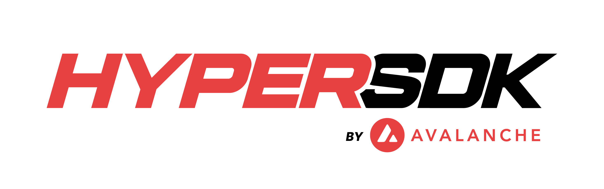

<p align="center">
  
</p>
<p align="center">
  Framework for Building High-Performance Blockchains on Avalanche
</p>
<p align="center">
  <a href="https://goreportcard.com/report/github.com/ava-labs/hypersdk"></a>
  <a href="https://github.com/ava-labs/hypersdk/actions/workflows/hypersdk-ci.yml"></a>
  <a href="./LICENSE" ></a>
  <a href="https://github.com/ava-labs/hypersdk/actions/workflows/codeql-analysis.yml"></a>
</p>

---

The Go implementation of HyperSDK. HyperSDK provides a high performance, customizable framework for building blockchains.

## Understanding the HyperSDK

The HyperSDK aims to provide good defaults, making it simple to build high performance blockchains, while enabling customization at each level of the stack.

### Actions

Actions represent the smallest unit of customization in the HyperSDK.

Each action is packaged and signed within a transaction type defined by the HyperSDK, which allows developers to focus exclusively on their application logic.

Actions implement `Execute` to define their state transition against a mutable key-value store:

```golang
Execute(
	ctx context.Context,
	r Rules,
	mu state.Mutable,
	timestamp int64,
	actor codec.Address,
	actionID ids.ID,
) (output codec.Typed, err error)
```

To provide performance out of the box, the `chain.Action` interface requires additional functions to provide state prefetching, pessimistic concurrency control, and multi-dimensional fees.

For the full details, see the MorpheusVM tutorial on implementing the `Transfer` Action [here](./docs/tutorials/morpheusvm/morpheusvm.md).

### Services

The HyperSDK comes with default services [here](./vm/defaultvm/vm.go) that can be enabled/disabled via config or programmatically.

Services are created by adding an [Option](./vm/option.go) to the VM. They can be configured programmatically by constructing your VM directly instead of using the default constructor and selecting which services to opt into. For example, to run with only the Indexer option enabled programmatically, you can construct your VM with:

```golang
// NewWithOptions returns a VM with the specified options
func New(options ...vm.Option) (*vm.VM, error) {
	options = append(options, With(), indexer.With()) // Add MorpheusVM API and Indexer
	return vm.New(
		consts.Version,
		genesis.DefaultGenesisFactory{},
		&storage.StateManager{},
		ActionParser,
		AuthParser,
		auth.Engines(),
		options...,
	)
}
```

To configure your option via config file, see [here](./docs/reference/config.md).

Services are registered as Options to the VM. This allows developers to provide the set of options they want when they instantiate their VM. The options are executed during `vm.Initialize`, so that the VM has all of the parameters the Service may need populated.

Currently, developers can define their service to register Custom APIs and Event Notifications from the VM.

To learn more about Services and Options in the HyperSDK, see their definition [here](./vm/option.go) and the default options available [here](./vm/defaultvm/vm.go).

### Components

Components will enable swapping out primitives (swap MerkleDB and Firewood) and large-scale components used by the HyperSDK.

For more information, see [Customizability](https://github.com/ava-labs/hypersdk/labels/customizability) and the HyperSDK Roadmap [here](https://x.com/AaronBuchwald/status/1829236582974456262).

## Getting Started

To get started building with the HyperSDK, check out `MorpheusVM`: the simplest VM you can build with the HyperSDK [here](./examples/morpheusvm/).

## Contributing

To get started contributing to the HyperSDK, see the [Contributing Guidelines](./CONTRIBUTING.md).

If you are looking for a place to get started, see [Good First Issues](https://github.com/ava-labs/hypersdk/labels/good%20first%20issue) and [Community Issues](https://github.com/ava-labs/hypersdk/labels/community).

## Status
`hypersdk` is considered **ALPHA** software and is not safe to use in production. The framework has not been audited and is under active development. This notice will be removed after the API has stabilized and the repo has completed a full audit.
