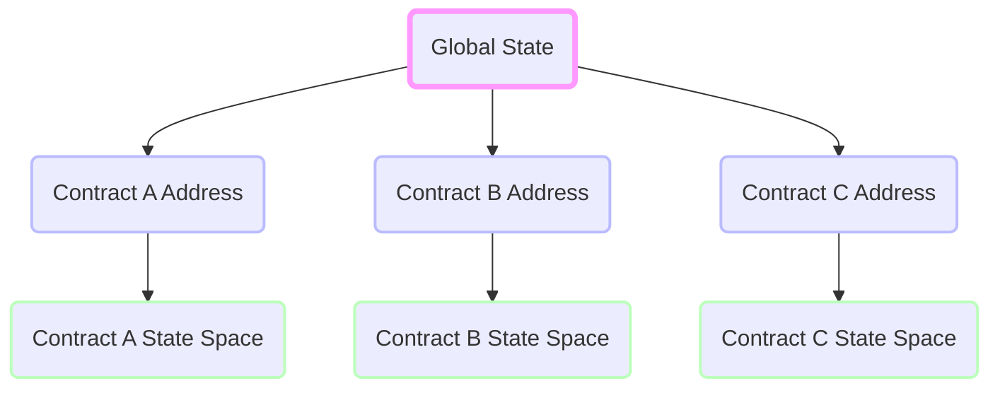
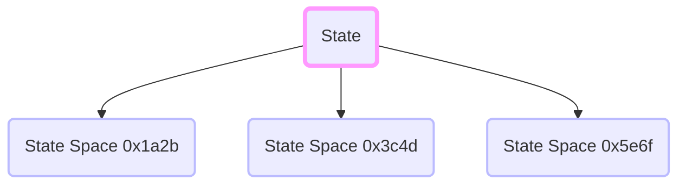
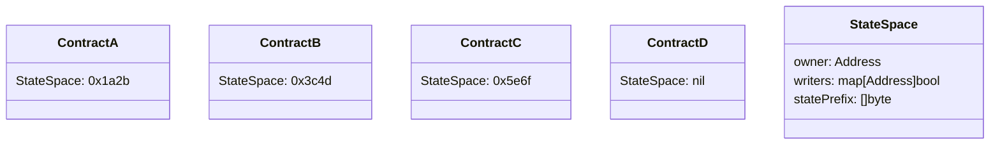

# Decoupling Code and State

Currently, a contract's state space is prefixed by its address.



The state space of a contract and contract code should be decoupled. StateSpace's(StatePrefixes) would become properties of contracts, with their own read/write/own permissions. Each contract would be instantiated with it's own state space, but would be able to freely move access and control as it pleases. This allows for much greater flexibility in how contracts interact with state, and offers a very clean and explicit interface for state access and ownership.





This design gives contracts much more flexibility regarding state access as contracts can share state and move ownership.

Exposing this functionality to contracts would only require one additional host function

```rust
	extern fn set_state_access(access: AccessControl)

	enum AccessControl {
		// gives `contract` write access to this contracts StateSpace
		// calling contract must have ownership of its StateSpace
		Write(Contract)
		// moves ownership to `contract`,
		// calling contract must have ownership,
		Own(Contract)
		// removes all access `contract` has to calling contract
		Remove(Contract)
		// allows `contract` to set StateSpace access to this contract
		Delegate(Contract)
	}
```

Sharing state among contracts would just require the contract to allow share permissions to other contracts. Since this logic would be written in the `#[public]` methods of contracts, these methods can explicitly code how access is granted. Can even make a contract that gives write access to the highest bidder after an auction, or give write access to anyone that pays a subscription fee every month.

Upgrading contracts are quite easy.

```rust
	Contract A
	pub fn upgrade(new: Address) {
		// validate caller & other logic...

		// change owner
		set_state_access(AccessControl::own(address))
	}

	Contract B
	pub fn init(contractA: Address) {
		// Allow contractA to move ownership to ContractB
		set_state_access(AccessControl::delegate(contractA))
	}
```

In this example, `ContractB` would be initialized thus letting `ContractA` to set it's StateSpace. Contract A would then move ownership to `ContractB` once granted access. If `ContractA` would still like write access, it can give itself write permissions before moving ownership to `contractB`
