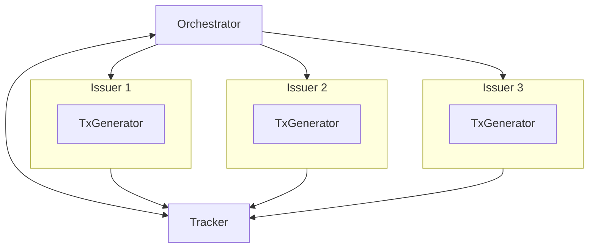

# Load

This package provides generic utilities for blockchain load testing. We break load generation down into the following components:

- tx generator(s)
- tx issuer(s)
- orchestrator
- tracker

The transaction generator(s) and issuer(s) may be VM specific and provide the
necessary injected dependencies for the orchestrator. This enables us to
construct different load testing strategies on top of the same re-usable code.
For example, we can re-use these components for a short burst of transactions or
to perform gradual load testing.

## Architecture

### Orchestrator

The role of the orchestrator is to lead the issuers and, when applicable,
reading the tracker to get the current state of the network.

### Transaction Generator

The TX generator is responsible for generating a valid transaction which any
issuer can send. 

### TX Issuer

The TX issuer has two responsibilities:
- Sending transactions to the network
- Listening for the status of transactions it has sent

The TX issuer also has the following obligations to the tracker:

- Upon sending a TX, the issuer should call `Issue()`
- Upon confirming an accepted TX, the issuer should call `ObserveConfirmed()`
- Upon confirming a failed TX, the issuer should call `ObserveFailed()`

### Tracker

The role of the tracker is to record metrics for the TPS.

## Default Orchestrators

This package comes with the following orchestrators:

### Short Burst

The short burst orchestator is used to send a fixed number ofs transactions to the network at
once. This orchestrator is parameterizable via the following:

- `N`: the number of transactions an issuer will send to the network.
- `timeout`: the amount of time which, after all transactions have been sent,
  the orchestrator will wait to hear the confirmation of all outstanding
  transactions. 
