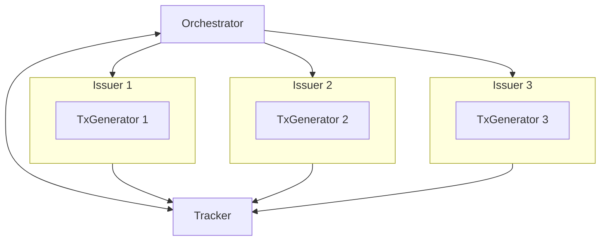

# Load

This package provides generic utilities for blockchain load testing. We break load generation down into the following components:

- tx generator(s)
- tx issuer(s)
- tracker
- orchestrator

The transaction generator(s) and issuer(s) may be VM specific and provide the
necessary injected dependencies for the orchestrator. This enables us to
construct different load testing strategies on top of the same re-usable code.
For example, we can re-use these components for a short burst of transactions or
to perform gradual load testing.

## Architecture



### Orchestrator

The orchestrator is responsible for directing issuers to send transactions to
the network. The strategy for how the orchestrator directs issuers varies
between implementations (e.g. short burst vs gradual load).

When applicable, the orchestrator can also query the tracker to make a decision
(e.g. increase TPS or return).

### Transaction Generator

The TX generator is responsible for generating a valid transaction which any
issuer can send. Each TX generator is assumed to have an associated account that
will sign transactions and whose balance is monitored to err in the case of fund exhaustion.

### TX Issuer

The TX issuer has two responsibilities:
- Sending transactions to the network
- Listening for the status of transactions it has sent

The TX issuer also has the following obligations to the tracker:

- Upon sending a TX, the issuer should call `Issue()`
- Upon confirming an accepted TX, the issuer should call `ObserveConfirmed()`
- Upon confirming a failed TX, the issuer should call `ObserveFailed()`

### Tracker

The role of the tracker is to record metrics for the TPS. Since the tracker is
used by both the issuers and the orchestrator, all methods of the tracker must
be thread safe.

## Default Orchestrators

This package comes with the following orchestrators:

### Short Burst

The short burst orchestator is used to send a fixed number ofs transactions to the network at
once. This orchestrator is parameterizable via the following:

- `N`: the number of transactions an issuer will send to the network.
- `timeout`: the maximum amount of time which, after all transactions have been sent,
  the orchestrator will wait to hear the confirmation of all outstanding
  transactions. 

### Gradual Load

The gradual load orchestrator sends transactions at a initial rate (TPS) and
increases that rate until hitting the maxiumum desired rate or until the
orchestrator determines that it can no longer make progress. 

The current TPS in the gradual load orchestrator is determined by taking the
number of transactions confirmed in a given time window (`SustainedTime`) and
diving it by `SustainedTime` (in terms of seconds) Furthermore, the orchestator
has `maxAttempt` tries to try and achieve a given TPS before determining that
the given TPS is not achievable.

Below is the pseudocode for how the gradual load orchestrator determines TPS and
for how it increases TPS:

```
currTargetTPS := current TPS we want to achieve
maxAttempts := maximum number of attempts we have to achieve currTargetTPS

txsPerIssuer := currTargetTPS / numOfIssuers
attempts := 0

for each issuer: // Async
    send txsPerIssuer txs per second
end for

for
    wait for SustainedTime

    tps := number of accepted TXs divided by the SustainedTime
    if tps >= currTargetTPS:
        increase currTargerTPS by step
        iters = 0
    else:
        if attempts >= maxAttempts:
            fail
        end if
        iters += 1
    end if
end for
```
