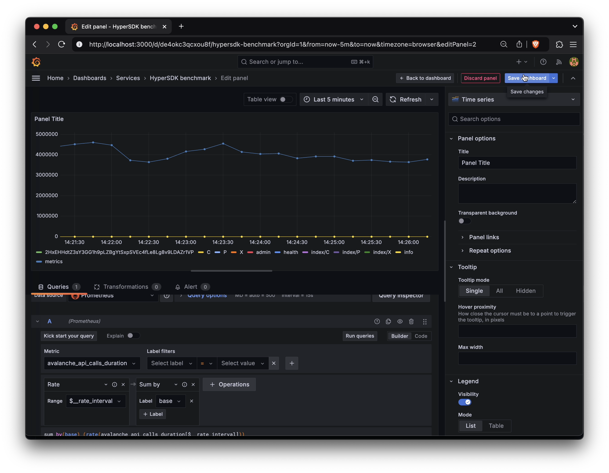

# Prometheus & Grafana Dashboard for HyperSDK

This setup collects and visualizes metrics from HyperSDK benchmarks.

## Prerequisites
- Docker
- MorpheusVM running locally (default address: localhost:9650)

## Quick Start
1. Run the dashboard using script `./x/grafana/dashboard.sh`
2. Open Grafana at [localhost:3000](http://localhost:3000)
3. Navigate to: [Dashboards > Services > HyperSDK benchmark](http://localhost:3000/d/de4okc3qcxou8f/hypersdk-benchmark)
4. Wait 15 seconds for the first data to appear. If it is not appearing, check that [localhost:9650/ext/metrics](http://localhost:9650/ext/metrics) is accessible and returning metrics. 

## Adding New Panels
1. Login to Grafana with:
   - Username: admin
   - Password: admin
   - (Skip the password change prompt)
2. Edit an existing panel
3. Click Save - this will show JSON
4. Copy the JSON to: `./x/grafana//dashboards/hypersdk-bench.json`

5. Restart Grafana to see changes:

```bash
docker rm -f grafana
./x/grafana/dashboard.sh
```
## Example of Adding Metrics
[](https://youtu.be/Pq3QKi1T1ts)
Check out a 2-minute demo on YouTube: [youtu.be/Pq3QKi1T1ts](https://youtu.be/Pq3QKi1T1ts)
